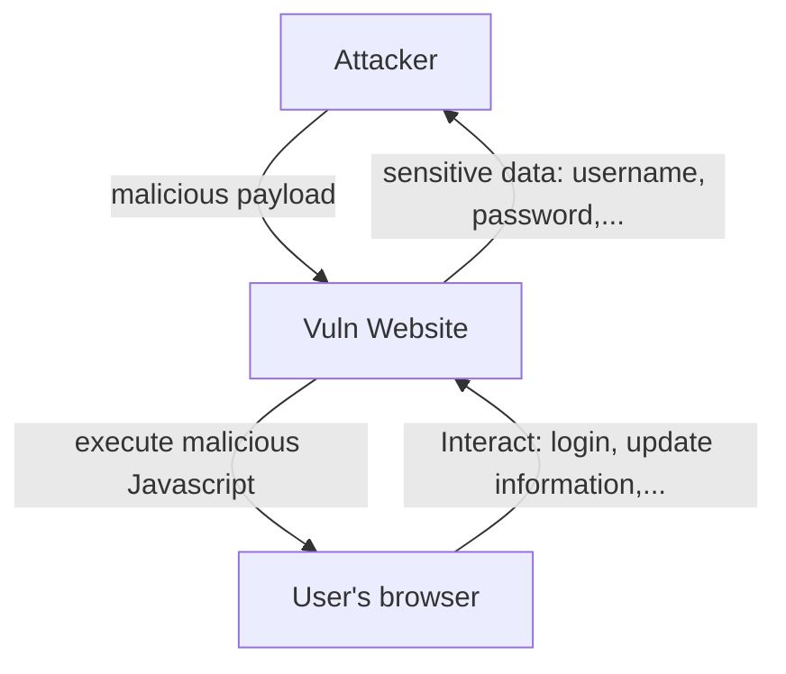

# Cross-site scripting (XSS)

%20images/Untitled.png)

# ****What is cross-site scripting (XSS)?****

```
Cross-site scripting (also known as XSS) is a web security vulnerability that allows an attacker to compromise the interactions that users have with a vulnerable application. It allows an attacker to circumvent the same origin policy, which is designed to segregate different websites from each other. Cross-site scripting vulnerabilities normally allow an attacker to masquerade as a victim user, to carry out any actions that the user is able to perform, and to access any of the user's data. If the victim user has privileged access within the application, then the attacker might be able to gain full control over all of the application's functionality and data.
```

- Is a web security vulnerability
- Allow an attacker to:
    - compromise (xâm phạm) the interactions between users and the application
    - circumvent (phá vỡ) the same origin policies which segregate (tách biệt) different website from each other.
    - masquerade (giả dạng) as a victim user → access user’s data
    - gain full control of the application’s functionality & data (If the victim user has privileged access with the application)

# How does XSS work?

Cross-site scripting works by manipulating a vulnerable web site so that it returns malicious JavaScript to users. When the malicious code executes inside a victim's browser, the attacker can fully compromise their interaction with the application.



# XSS proof of concept (PoC)

`alert()` is the most common function used to inject payload.

However, since Chrome version 92 onward (July 20th, 2021), cross-origin iframes are prevented from calling `alert()`.

Therefore, using `print()` instead is recommended!

%20images/Untitled%201.png)

Read more at this [blog](https://portswigger.net/research/alert-is-dead-long-live-print)

# Main types of XSS attacks

- [Reflected XSS](#): where the malicious script comes from the current HTTP request.
- [Stored XSS](#): where the malicious script comes from the website's database.
- [DOM-based XSS](Sub_Pages/DOM%20XSS%20in%20documentWrite%20sink%20using%20source%20locationSearch.md): where the vulnerability exists in client-side code rather than server-side code.

# **What can XSS be used for?**

An attacker who exploits a cross-site scripting vulnerability is typically able to:

- Impersonate or masquerade as the victim user.
- Carry out any action that the user is able to perform.
- Read any data that the user is able to access.
- Capture the user's login credentials.
- Perform virtual defacement of the web site.
- Inject trojan functionality into the web site.

# **Impact of XSS vulnerabilities**

The actual impact of an XSS attack generally depends on the nature of the application, its functionality and data, and the status of the compromised user. For example:

- In a brochureware application, where all users are anonymous and all information is public, the impact will often be minimal.
- In an application holding sensitive data, such as banking transactions, emails, or healthcare records, the impact will usually be serious.
- If the compromised user has elevated privileges within the application, then the impact will generally be critical, allowing the attacker to take full control of the vulnerable application and compromise all users and their data.

# References

[https://portswigger.net/web-security/cross-site-scripting](https://portswigger.net/web-security/cross-site-scripting)